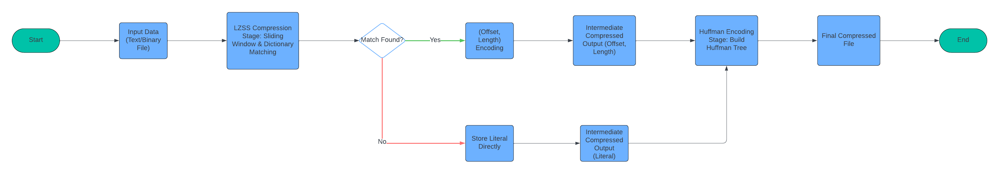

# Compression Tool 🚀  
A high-performance text compression tool combining **LZSS** and **Huffman encoding** for optimized storage and fast execution.

## 📌 Overview  
This tool implements a hybrid compression algorithm combining **LZSS** and **Huffman encoding** to achieve **efficient text compression**.  
- 🚀 **Fast Execution:** Compresses large datasets in less than **one second**.  
- 📉 **High Compression Ratio:** Achieves **~70% compression** across multiple datasets.  
- 🔧 **Optimized for Any Dataset:** Supports any language or symbol set without predefined frequency constraints.

## 📌 Compression Flowchart

The diagram below illustrates how the hybrid compression algorithm works, combining **LZSS** for dictionary-based compression and **Huffman encoding** for entropy-based compression.




## ✨ Features  
- **Hybrid Compression:** Combines LZSS and Huffman coding to maximize compression ratio and speed.  
- **Fast Execution:** Optimized for performance, completing compression in under a second.  
- **Efficient Bitwise Operations:** Reduces output size with compact bitstream representations.  
- **Language & Symbol Agnostic:** Works with any dataset, dynamically generating the dictionary on the fly.

## 📊 Performance Metrics  
| **File Size** | **LZSS Output** | **Final Huffman Output** | **Final Compression Ratio** |
|--------------|----------------|------------------------|----------------------|
| 1,929,659 B | 820,435 B (57.48%) | 608,801 B (68.46%) | **68.46%** |
| 1,843,146 B | 758,553 B (58.84%) | 608,801 B (67.02%) | **67.02%** |

## ⚙️ Installation & Usage  
Clone the repository and build the project:
```sh
git clone https://github.com/Salah-Tamer/Compression-Tool.git
cd compression-tool
dotnet build
```

### Compress a file:  
```sh
dotnet run --compress input.txt output.ct
```

### Decompress:  
```sh
dotnet run --decompress output.ct restored.txt
```

## 🔬 Algorithms Used  
### 1️⃣ LZSS (Lempel-Ziv-Storer-Szymanski) Compression  
LZSS is a **dictionary-based compression algorithm** that replaces repeated occurrences of data with references to a single copy stored dynamically.  

**Implementation Details:**
- **Search Buffer:** 512 KB  
- **Lookahead Buffer:** 259 bytes  
- **Encoding:** Matches are encoded using a (distance, length) pair; unmatched characters are stored directly.  
- **Optimizations Applied:**
  - **Improved Substring Matching:** Uses a **hash table** for quick lookup.
  - **Efficient Bitstream Representation:** Bitwise encoding for compact storage.
  - **Enhanced Lookahead Buffer:** Detects **longer** matches, increasing compression efficiency.

### 2️⃣ Huffman Compression  
Regular Huffman encoding assigns binary codes to symbols based on a frequency tree. However, storing the tree can introduce overhead.  
To optimize, we use **Canonical Huffman Encoding**, which sorts symbols by code length and assigns binary values predictably. This reduces the need for storing the full tree.  

**Optimized Huffman Strategy:**  
- **Instead of encoding the entire compressed stream, we separate components into:**
  - **Literals:** Actual byte values.  
  - **Backward distances:** References to repeated sequences.  
  - **Match lengths:** Lengths of repeated sequences.  
- **Results:**  
  - Applying Huffman to the entire compressed stream: **7.81% additional compression**.  
  - Applying Huffman to separate streams individually: **27.92% additional compression**.  
  - **Final Result:** Reduced file size from **699,346 bytes → 608,801 bytes** by handling streams separately.  

## 🚀 Performance & Optimizations  
- **Substring Hashing:** Speeds up pattern detection.  
- **Bitwise Encoding:** Minimizes wasted space in compressed output.  
- **Canonical Huffman Trees:** Reduces storage overhead by encoding only symbol lengths.  
- **Optimized Lookahead & Search Buffers:** Increased likelihood of long matches.  

## 🔍 Challenges & Learnings  
- **Optimizing LZSS Matching:** Replacing brute-force lookup with a **hash table** improved speed by **~40%**.  
- **Reducing Huffman Overhead:** Using **Canonical Huffman Encoding** instead of traditional tree storage saved **~15% extra space**.  
- **Handling Large Files:** Efficient **bitwise operations** allowed seamless compression of multi-megabyte files.  

## 🤝 Contributing  
We welcome contributions! Feel free to open an issue or submit a pull request.  

## 📜 License  
This project is licensed under the MIT License.
