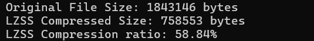
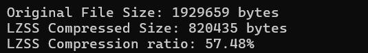

# Compression Tool
This tool is designed for efficient text compression by combining two powerful algorithms: **LZSS** and **Huffman coding**. Leveraging this hybrid approach, the tool achieves high compression ratios and fast performance—consistently reaching around **70% compression on ten different datasets** and completing compression in **less than one second**.

---

## Features

- **Hybrid Compression:** Combines **LZSS** and **Huffman coding** to maximize compression ratio and speed.
- The algorithm works with any dataset containing any language or symbols without any frequency limitations because the dictionary is generated on the fly based on the data.
- **Fast Execution:** Optimizes both memory and performance to deliver compression in less than one second.
- **Efficient Bitwise Operations:** Reduces output size with compact bitstream representations.

---
## Algorithms Used

### 1. LZSS (Lempel-Ziv-Storer-Szymanski) Compression

**LZSS** is a dictionary-based compression algorithm that replaces repeated occurrences of data with references to a single copy stored in a dynamically generated dictionary.

#### Expected Compression Ratio

- **LZSS Alone:** Achieves an average compression ratio of approximately **50%**, depending on the dataset.
      
      

#### Implementation Details

- **Search Buffer:** 512 KB
- **Lookahead Buffer:** 259 bytes
- **Encoding:** Matches are encoded using a **(distance, length)** pair to reduce redundancy; unmatched characters are stored directly.
- **Mapping:** A character-to-byte mapping is created to convert text into a compact byte stream.

#### Optimizations Applied

- **Improved Substring Matching:**
    - Uses a substring hash table to quickly locate repeated sequences.
    - Reduces search time by storing and looking up fixed-length substrings.
- **Efficient Bitstream Representation:**
    - Implements bitwise operations to store match lengths and distances compactly.
    - Minimizes wasted space in the output bitstream.
- **Enhanced Lookahead Buffer:**
    - A larger lookahead buffer (259 bytes) compared to traditional implementations (e.g., 32 or 64 bytes) allows for detecting longer matches.
    - An expanded search buffer increases the likelihood of finding repeated sequences.